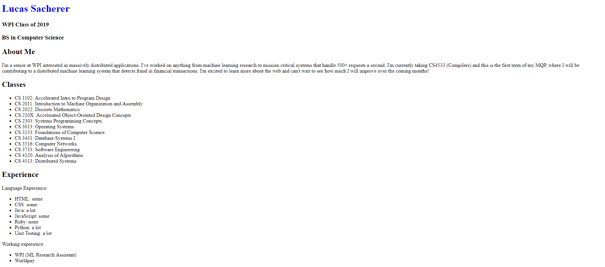

Assignment A1 - Lucas Sacherer
==============================

Lucas Sacherer
 
https://a1-lucassacherer.herokuapp.com

Like instructed, this website is a small introduction to me as a person. This project 
shows a basic understanding of HTML and CSS. I focused almost all my efforts to the 
front-end of this application.

## Design Achievements
- **CSS Grid:** Shown at the end of `style.css`, I decided to use CSS grid to setup the
                "Block" structure of the website. I had never done anything like it, but
                found it very easy to use and understand (it also enabled my responsive
                layout discussed below). In general, I looked up other websites that use
                a "Metro" style and tried to imitate what works with those layouts and
                colors.
- **Responsive Design:** I set up `style.css` to change the layout of the grid for 
                         specific sized screens. From a design point of view, I tried 
                         to come up with 3 layouts, one for desktop, one for tablets,
                         and one for phones. I tested them on my devices, and they seem
                         to work reasonably well.
- **Design Process:** I went through 2 design iterations, first trying my best at making
                      the site look acceptable, then asking for feedback and
                      implementing the changes. The pictures of each phase and the 
                      feedback I got is in the appendix bellow.

## Technical Achievements
- **Setup Server for style.css:** To be able to serve `style.css`, I had to modify the
                                  server to recognize the new request and send back the
                                  correct file. I noticed that Chrome was complaining
                                  that the `style.css` file was being sent as 
                                  'text/html', so I modified the `sendFile()` function
                                  to take the content type as an argument.
- **Map on the Page:** I added a map to the page so that I could better display all the
                       places where I've lived. I set up the map to show a pin at all the
                       cities where I've lived and set up the buttons with the city names 
                       in the "PLACES I'VE LIVED" box to focus the map on that city.
- **Responsive Design:** I set up `style.css` to change the layout of the grid for 
                         specific sized screens. From a technical point of view, I 
                         researched how to use `@media` tags in `style.css` to
                         conditionally change the layout of the grid. Since I had 3 
                         layouts, I ended up with 2 `@media` tags (and one default 
                         layout).

## Appendix - Design Responses
- Emily Thayer
  - Stick to 2/3 main colors and use shading for different colors
  - Put buttons in "PLACES I'VE LIVED" in a table instead of a list
  - Capitalize the 'e' in "Working Experience"
  - Match the font of the buttons in "PLACES I've LIVED" with all the
    other fonts
  - Otherwise, the fonts are good
- Jake Kenney
  - Move the titles of the blocks into the corner (reduce the padding
    on top)
  - Change the red fade (Make it darker)
  - More spacing in-between the class numbers and the class names
  - Pick a hot or a cold color scheme, not both
- Erin Conneilly
  - Red needs to be less bright
  - Buttons in "PLACES I'VE LIVED" should be white with blue text
  - Add "Click to show on map" in "PLACES I'VE LIVED"
  - Order buttons by having US cities on left and EU cities on right
  - make everything darker (color)
  - border on map looks OK
  - add periods to the BS in "BS in Computer Science"
  - Change class to course in the "Classes" block

## Appendix - Design Pictures
### First Design (No style)

### Second Design (First try at style)
(The Middle was cut out on these pictures)

### Final Design (No style)

